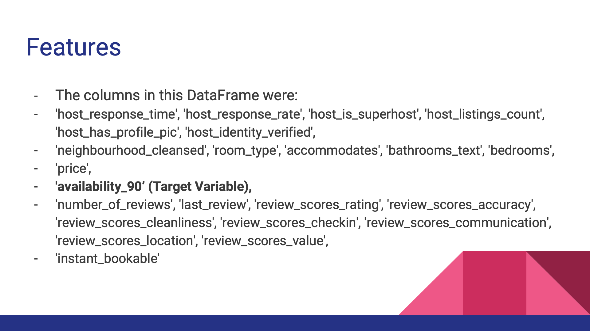
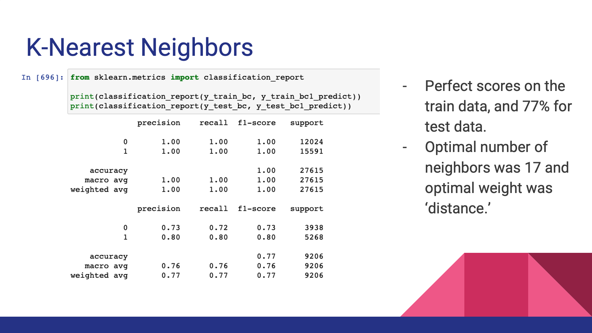
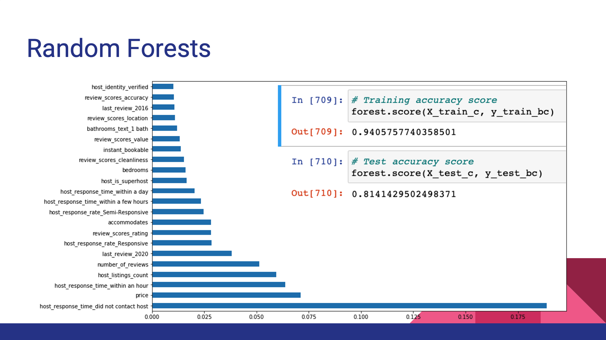

## Purpose
Machine learning models were used to identify which Airbnb listings were to have no bookings for the next 90 days.

## Data
- This analysis uses Airbnb listings data in New York City on December 10th, 2020.
- Data was provided by Airbnb: http://insideairbnb.com/ 

## Insights

## Key Findings
- Highest impact was whether the client reached out to the host or not.
  - There should not be any ambiguity in the listing that require the client to contact the host. 
- Price had the second highest impact. 
- Host response rate generally had the greatest impact.
  - it is essential that the host responds immediately to their potential clients!
- It was important that the listing had a review in 2020.
- The features of the property did not have a profound impact.

## Future Works
- Implement NLP/Naive Bayes to analyze listing information (i.e., description, title, amenities)
- Classify booked listings to gain insight on which listings tend to do well.
